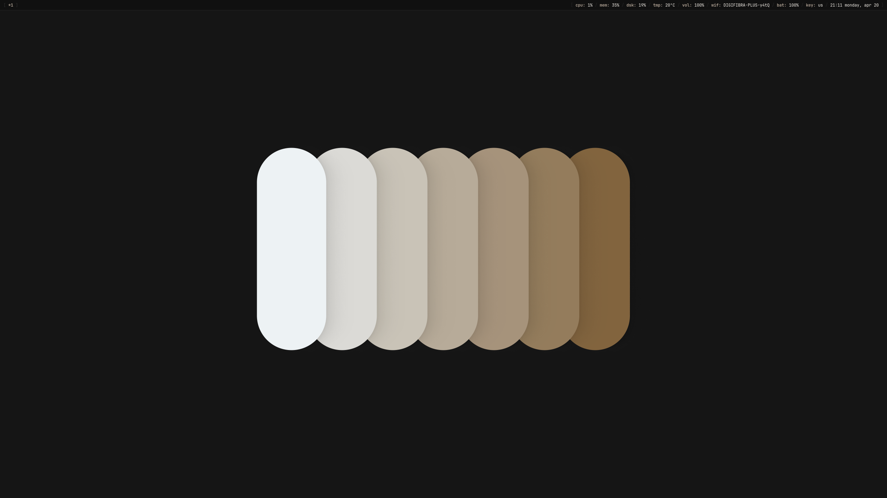

# Midcentury Dark



A warm, minimal, and highly structured Wayland configuration for Ubuntu 24.04. 

**Midcentury Dark** strips away unnecessary visual noise, favoring a tactile, earthy color palette, sharp corners, and highly intentional spacing. Built entirely around Sway and Wayland-native tools, this setup is designed to get out of your way while remaining incredibly pleasing to look at.

## 🎨 The Aesthetic

The color palette is built on deep blacks, subtle grays, and warm, earthy accents to reduce eye strain while providing clear visual hierarchy. 

| Element | Color | Hex |
| :--- | :--- | :--- |
| **Background** | Deep Onyx | `#101010` |
| **Background (Alt)** | Raised Gray | `#252525` |
| **Borders** | Subtle Outline | `#303030` |
| **Foreground** | Warm White | `#f6f1ea` |
| **Accent** | Midcentury Wood | `#afa193` |

*Note: Critical alerts and custom terminal colors use complementary muted tones (like `#cc6666` for red and `#d8a657` for gold) to maintain the warm aesthetic.*

## ⚙️ Core Components

* **OS:** Ubuntu 24.04
* **Window Manager:** Sway (Wayland)
* **Bar:** Waybar
* **Launcher:** Rofi (Wayland fork)
* **Terminal:** Kitty
* **Notifications:** Mako
* **Display Manager:** Kanshi
* **Font:** JetBrainsMono Nerd Font
* **Icons:** Papirus

## 📦 Dependencies

To replicate this setup on Ubuntu 24.04, you will need to install the following packages:

```bash
# Core Wayland and Sway packages
sudo apt install sway waybar mako-notifier kanshi

# Terminal, Launcher, and styling
sudo apt install kitty rofi papirus-icon-theme

# Fonts (Ensure you install the Nerd Font variant manually or via package manager)
sudo apt install fonts-jetbrains-mono
